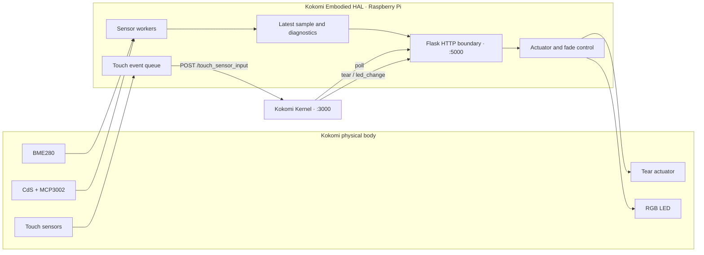

# Kokomi Embodied HAL


Kokomi Embodied HAL is the Raspberry Pi hardware boundary for the Kokomi embodied-agent research platform. It converts physical sensor signals into stable HTTP resources, translates validated Kernel actions into GPIO/PWM output, and forwards capacitive-touch transitions to Kokomi Kernel as typed events.

The service is a deployment-specific hardware adapter, not a general-purpose device framework. Its public contract is the behavior of [`kokomi_raspi.py`](kokomi_raspi.py); superseded drivers and hardware experiments are isolated under [`archives/`](archives/README.md).

## System status

| Area | Current state | Operational meaning |
| --- | --- | --- |
| BME280 environment sensing | Implemented | Forced-mode temperature, pressure, and humidity sampling with health metadata |
| CdS brightness sensing | Implemented | Raw 10-bit ADC sampling through MCP3002 channel 0 |
| Capacitive touch | Implemented | Debounced three-channel input forwarded as Kernel touch events |
| Tear actuator | Implemented | Strict JSON command translated to bounded PWM and duration |
| RGB LED | Implemented | Strict hexadecimal color command with asynchronous PWM fading |
| Device diagnostics | Partially implemented | Detailed BME280 and touch status; CdS and actuator diagnostics remain implicit |
| Authentication and transport security | Not implemented | The HTTP surface is intended for a trusted private network |
| Nine-axis IMU | Experimental | BNO055 work is archived and is not part of the operational service |

## Architectural model



### Authority boundaries

- The HAL owns GPIO, I2C, SPI, PWM, device sampling, debounce, and local device-health state.
- Kokomi Kernel owns persistent observations, freshness policy beyond the transport response, world-state derivation, action authorization, cooldowns, and outcome history.
- Sensor resources report measurements and adapter health; they do not infer emotional or semantic state.
- The HAL validates the complete actuator payload again even when the request originated from the Kernel action gate.
- A successful actuator response means the local command completed according to the adapter; broader physical effects are not independently sensed.

## Runtime composition

The operational repository surface is intentionally small.

| Path | Responsibility |
| --- | --- |
| `kokomi_raspi.py` | Flask service, sensor workers, touch forwarding, actuator validation, PWM control, and resource cleanup |
| `README.md` | Current hardware and protocol contract |
| `LICENSE` | MIT license terms |
| `.gitignore` | Exclusion of generated Python caches and local virtual environments |
| `archives/` | Non-operational experiments, superseded adapters, diagnostics, and implementation prompts |

The service binds to `0.0.0.0:5000` and uses Flask's threaded request handling. Device objects and PWM channels are created during module initialization. Background workers start when the module is executed as the main program.

## Physical bindings

All GPIO identifiers use Broadcom SOC numbering rather than physical header-pin numbers.

| Function | Device binding | Electrical/software mode |
| --- | --- | --- |
| Environment | BME280 at I2C bus `1`, address `0x76` | Forced conversion, 1× temperature/pressure/humidity oversampling |
| Brightness | MCP3002 at SPI bus `0`, CE0, channel `0` | 100 kHz SPI, raw 10-bit result |
| Tear actuator AIN1 | BCM GPIO `20` | 100 Hz PWM |
| Tear actuator AIN2 | BCM GPIO `21` | 100 Hz PWM, held at 0 during forward motion |
| RGB red | BCM GPIO `17` | 1 kHz PWM |
| RGB green | BCM GPIO `27` | 1 kHz PWM |
| RGB blue | BCM GPIO `22` | 1 kHz PWM |
| Touch `touch_01` | BCM GPIO `5` | Active-high input with pull-down |
| Touch `touch_02` | BCM GPIO `6` | Active-high input with pull-down |
| Touch `touch_03` | BCM GPIO `13` | Active-high input with pull-down |

The motor interface assumes an external motor driver. The GPIO pins are control signals and are not a motor power source.

## Runtime workers

| Worker | Cadence | Behavior |
| --- | ---: | --- |
| BME280 sampler | 1 s after each completed cycle | Reinitializes after an error and retries after 2 s |
| CdS sampler | 1 s | Replaces the latest raw ADC value and timestamp |
| Touch reader | 10 ms | Debounces state changes for 50 ms and enqueues transitions |
| Touch sender | Event-driven | Delivers queued events with bounded retry |
| RGB fade | 30 ms | Moves each channel by 2 percentage points toward its target |

The touch queue holds at most 100 events. A full queue drops the new event and records an adapter error. Delivery uses a 2-second request timeout, up to three attempts, and linear retry delays of 250 ms and 500 ms.

## Configuration contract

| Name | Default | Semantics |
| --- | --- | --- |
| `TOUCH_ENDPOINT_URL` | `http://192.168.0.42:3000/touch_sensor_input` | Complete Kernel URL receiving touch envelopes |

All other hardware bindings and timing constants are currently code-level configuration in `kokomi_raspi.py`.

## HTTP surface

| Method | Route | Function |
| --- | --- | --- |
| GET | `/` | Service identity, route inventory, and configured touch target |
| GET | `/bme280/sensor_data` | Latest compensated environment sample and health state |
| GET | `/bme280/diagnostics` | BME280 identity, raw sample counters, and error diagnostics |
| GET | `/cds/sensor_data` | Latest raw brightness sample |
| GET | `/touch/status` | Touch input, delivery, and queue status |
| POST | `/motor/command` | Synchronous tear-actuator command |
| POST | `/led/command` | Asynchronous RGB target-color command |

Flask serializes returned mappings as JSON. The service does not expose authentication, authorization, CORS policy, or TLS termination.

## Sensor contracts

### Environment sample

`GET /bme280/sensor_data` returns:

```json
{
  "temp": 24.8,
  "pressure": 1012.6,
  "humidity": 48.3,
  "timestamp": 1780000000.0,
  "sample_count": 42,
  "unchanged_samples": 0,
  "age_seconds": 0.31,
  "error": null,
  "status": "ok"
}
```

| Field | Type | Semantics |
| --- | --- | --- |
| `temp` | number or `null` | Compensated temperature in degrees Celsius |
| `pressure` | number or `null` | Compensated pressure in hPa |
| `humidity` | number or `null` | Compensated relative humidity in percent, clamped to `0..100` |
| `timestamp` | number or `null` | Unix wall-clock time of the latest valid sample |
| `sample_count` | integer | Valid samples accepted since process start |
| `unchanged_samples` | integer | Consecutive valid samples whose complete raw tuple matches the previous tuple |
| `age_seconds` | number or `null` | Monotonic age of the latest valid sample |
| `error` | string or `null` | Latest BME280 initialization or sampling error |
| `status` | enum | `error`, `starting`, `stale`, `unchanged`, or `ok` |

Status precedence is deterministic:

1. `error` when a current adapter error exists.
2. `starting` before the first valid sample.
3. `stale` when the latest sample is older than 3 seconds.
4. `unchanged` after at least 10 repeated raw samples.
5. `ok` otherwise.

The adapter accepts temperature only within `-40..85 °C` and pressure only within `300..1100 hPa`. Invalid readings enter the retry path and do not replace the latest valid sample.

### BME280 diagnostics

`GET /bme280/diagnostics` returns:

```json
{
  "chip_id": "0x60",
  "sample_count": 42,
  "last_raw": {
    "pressure": 415148,
    "temperature": 519888,
    "humidity": 28754
  },
  "unchanged_samples": 0,
  "last_error": null,
  "last_error_timestamp": null,
  "i2c_bus": 1,
  "i2c_address": "0x76"
}
```

The expected chip ID is `0x60`. `last_raw` and `chip_id` are `null` until available. Raw values are uncompensated register readings and are diagnostic data, not physical units.

### Brightness sample

`GET /cds/sensor_data` returns:

```json
{
  "cds": 512,
  "timestamp": 1780000000.0
}
```

`cds` is an MCP3002 result in the inclusive range `0..1023`. It has no physical unit; the direction and transfer function depend on the external CdS voltage-divider circuit. Both fields are `null` before the first sample.

### Touch status

`GET /touch/status` returns:

```json
{
  "endpoint_url": "http://kernel.local:3000/touch_sensor_input",
  "sensors": {
    "touch_01": { "pin": 5, "touched": false },
    "touch_02": { "pin": 6, "touched": true },
    "touch_03": { "pin": 13, "touched": false }
  },
  "last_event": {
    "source": "touch",
    "type": "touch_started",
    "sensor_id": "touch_02",
    "sent_at": 1780000000.0,
    "http_status": 200
  },
  "last_error": null,
  "last_error_timestamp": null,
  "queued_events": 0
}
```

`sensors` is initially empty until the reader worker initializes. `last_event` describes the most recent successful delivery and is initially `null`. `last_error` records GPIO initialization, queue overflow, or the most recent exhausted HTTP delivery error.

## Outbound touch contract

For every debounced transition, the HAL posts the following strict envelope to `TOUCH_ENDPOINT_URL`:

```json
{
  "event": {
    "source": "touch",
    "type": "touch_started",
    "sensor_id": "touch_01"
  }
}
```

| Field | Allowed value |
| --- | --- |
| `event.source` | `touch` |
| `event.type` | `touch_started` or `touch_ended` |
| `event.sensor_id` | `touch_01`, `touch_02`, or `touch_03` |

Any non-2xx response is treated as a failed attempt. Events are removed from the local queue after success or after all attempts fail; there is no durable retry store.

## Actuator command contract

Both actuator routes require `Content-Type: application/json`, a top-level JSON object, exact key sets, and exact parameter types. Missing keys, extra keys, invalid JSON, invalid values, arrays, and scalar bodies return HTTP `400`:

```json
{
  "error": "validation message"
}
```

### Tear actuator

`POST /motor/command` accepts exactly:

```json
{
  "type": "tear",
  "params": {
    "speed": 10,
    "duration": 5
  }
}
```

| Parameter | Contract |
| --- | --- |
| `type` | Exact string `tear` |
| `speed` | Integer `0..255`; booleans and floating-point values are rejected |
| `duration` | Integer `0..255` seconds; booleans and floating-point values are rejected |

The PWM conversion is:

```text
duty_percent = 40 + (speed / 255) × 60
```

AIN1 receives the computed duty and AIN2 remains at zero. The request handler waits for `duration` seconds, stops both motor PWM outputs, and then returns:

```json
{
  "status": "OK",
  "type": "tear",
  "speed": 10,
  "duty": 42.4,
  "duration": 5
}
```

Validation failure explicitly stops the motor before returning. A `speed` value of `0` currently maps to 40% duty; it does not mean zero output. Concurrent motor commands are not serialized by the HAL.

### RGB LED

`POST /led/command` accepts exactly:

```json
{
  "type": "led_change",
  "params": {
    "color": "#00FF00"
  }
}
```

| Parameter | Contract |
| --- | --- |
| `type` | Exact string `led_change` |
| `color` | Seven-character `#RRGGBB` hexadecimal string |

Each 8-bit channel is converted to PWM percent, rounded to one decimal place:

```text
pwm_percent = round(channel / 255 × 100, 1)
```

The route updates the target color and returns immediately; the fade worker applies the physical transition asynchronously.

```json
{
  "status": "OK",
  "type": "led_change",
  "color": "#00FF00",
  "pwm": {
    "red": 0,
    "green": 100,
    "blue": 0
  }
}
```

The returned color is normalized to uppercase. The physical interpretation assumes a non-inverted PWM path; common-anode or active-low hardware requires an adapter change.

## Lifecycle and failure semantics

- BME280 failures are retained in diagnostics, and initialization is retried without discarding the last valid sample.
- CdS sampling has no local retry or diagnostic state; an uncaught SPI error terminates that worker.
- Touch input and HTTP delivery are decoupled so network latency does not block GPIO sampling.
- Touch delivery is best-effort and memory-only; process exit loses queued events.
- Motor execution is synchronous per request and always ends with `motor_stop()` on the normal success path.
- LED commands are target updates; successful HTTP return does not wait for the fade to finish.
- Process cleanup closes SPI and I2C handles, stops motor and LED PWM objects, and calls `GPIO.cleanup()`.

## Safety invariants

1. Malformed or unknown actuator fields do not reach PWM control.
2. An invalid tear command forces both motor PWM channels to zero.
3. BME280 identity must match chip ID `0x60` before samples are accepted.
4. Out-of-range BME280 temperature and pressure readings are rejected.
5. Touch state changes must remain stable for 50 ms before an event is emitted.
6. The touch queue is bounded; overload becomes explicit diagnostic state rather than unbounded memory growth.
7. Device resources and PWM outputs are released during registered process cleanup.
8. Network access must be restricted externally because the service itself has no authentication or encryption.

## License

The repository is licensed under the [MIT License](LICENSE).
